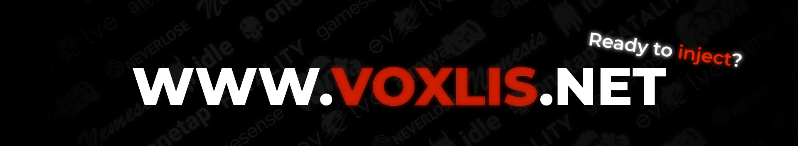

<p align="center">
   ✨ It's not really a secret, the website is mostly written with GPT ✨
</p>


# Domains 

1. [robloxhackers.lol](https://robloxhackers.lol)
2. [voxlis.net](https://voxlis.net)

# Table of Contents

- [Domains](#domains)
- [Table of Contents](#table-of-contents)
- [Project Setup Guide](#project-setup-guide)
  - [Public Server](#public-server)
  - [Local Server (On your computer)](#local-server-on-your-computer)
    - [Quick and Dirty](#quick-and-dirty)
    - [Slow and Robust](#slow-and-robust)

# Project Setup Guide

Run this command to install the Github repo, it's needed for the rest of the instructions.
```powershell
git clone 'https://github.com/localscripts/localscripts.github.io.git' && cd localscripts.github.io'
```

## Public Server

There are two free static hosting providers that are the best:
1. [Netlify](https://www.netlify.com/) (*suggested*)
1. [Github Pages](https://pages.github.com/)

The instructions for both options are well documented and would add too much bloat if added here. [Instructions for Netlify](https://docs.netlify.com/get-started/), and [instructions for Github Pages](https://docs.github.com/en/pages/quickstart).

## Local Server (On your computer)

1. **Install Visual Studio Code**
   - Download and install from [Visual Studio Code](https://visualstudio.microsoft.com/).

If you want to see the website but not host it, follow the [quick and dirty](#quick-and-dirty) instructions. If you want to host the server in a public context, follow the [slow and robust](#slow-and-robust) instructions (not recommended when hosted on a personal device). 

### Quick and Dirty
1. Install the extension `Live Preview` (The publisher should be `microsoft.com`). If you can't find it using the extension explorer in VSCode, you can manually install it by going to [this site](https://marketplace.visualstudio.com/items?itemName=ms-vscode.live-server).

1. Open the github repo in VSCode, right click `index.html` and select `Show Preview`. This will open a tab in VSCode. If you want to see the website in your browser, the just copy the URL in the VSCode tab and enter it in your preferred browser.

### Slow and Robust
1. **Install Python (if not already installed)**
   - Download and install from [Python](https://www.python.org/).

1. **Install NPM (using WinGet)**
   - Run this Powershell line to install `npm`
      ```powershell
      winget install -e --id OpenJS.NodeJS
      ```

1. **Open the Folder in Visual Studio Code**
   - Launch Visual Studio Code and open the extracted folder.

1. **Open a Terminal in Visual Studio Code**
   - Press `Ctrl+Shift+~` to open a new terminal window in Visual Studio Code.

1. **Install `http-server` Globally**
   - Run the following command to install `http-server`:
     ```powershell
     npm install -g http-server
     ```
1. **Start a Python HTTP Server**
   - Run the following command to start a Python HTTP server:
     ```powershell
     python -m http.server
     ```
1. **Find Your Local IP Address**
   - Press `Windows+R`, type `cmd`, and hit `Enter` to open Command Prompt.
   - Run the command `ipconfig` and locate your IPv4 Address.

1. **Access Your Project in a Browser**
   - Open your browser and navigate to `<IP>:<Port>`. For example, if your IP address is `192.168.1.10` and the port is `8000`, enter `http://192.168.1.10:8000`. If you don't know your current local IP address, you can get it using this Powershell line:
      ```powershell
      Get-NetIPAddress | Where-Object {$_.AddressFamily -eq 'IPv4' -and $_.InterfaceAlias    -ne 'Loopback Pseudo-Interface 1'} | Select-Object IPAddress
      ```
   This will give several IP addresses, pick the first one that starts with `192`. The others are either APIPA addresses, loopback addresses, or explicitly set on your machine.

> [!WARNING]
> Using this method will run the server on your computer and should only be used for debugging. This means anyone who navigates to it is *connecting directly to the hosting device*. This can be a significant security issue if you don't know what you're doing, so limit access to this website to your local network when hosting on a personal computer. If you want to host a public website, refer to the [public server instructions](#public-server).